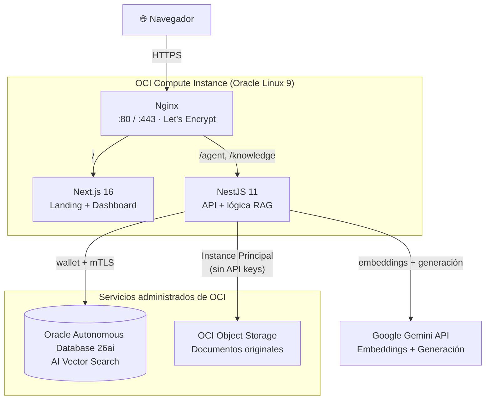
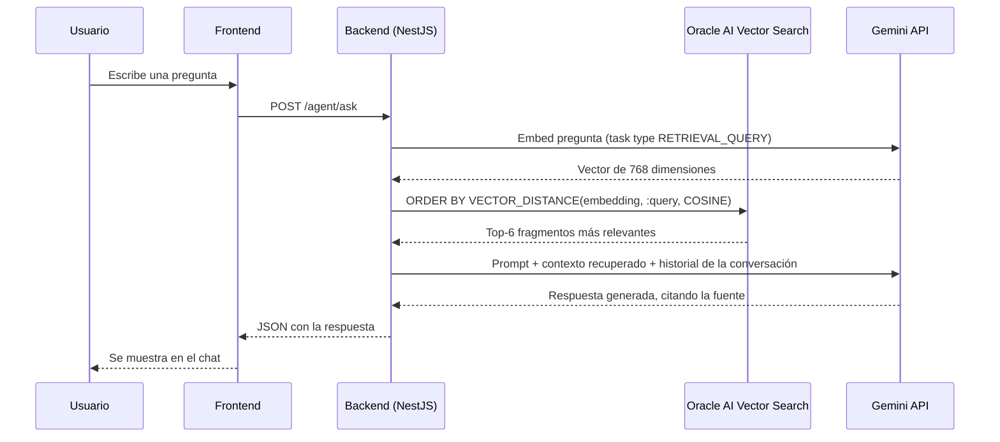
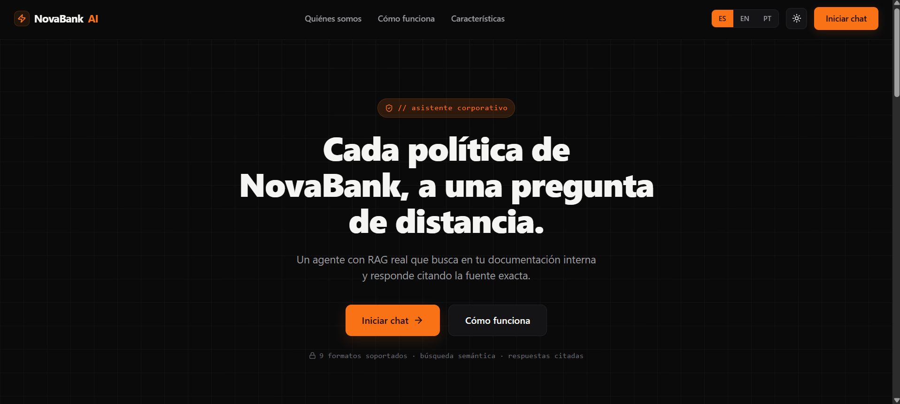
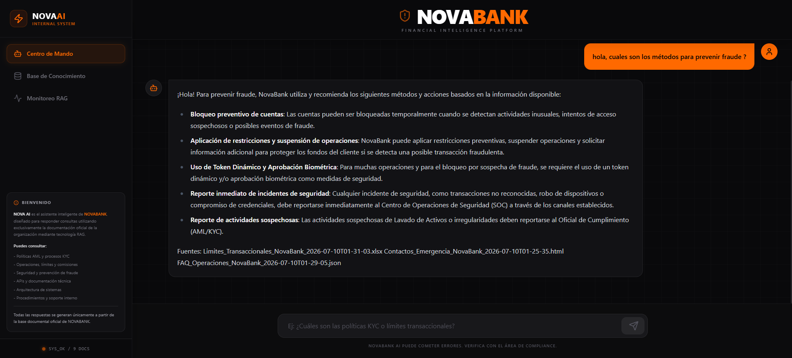
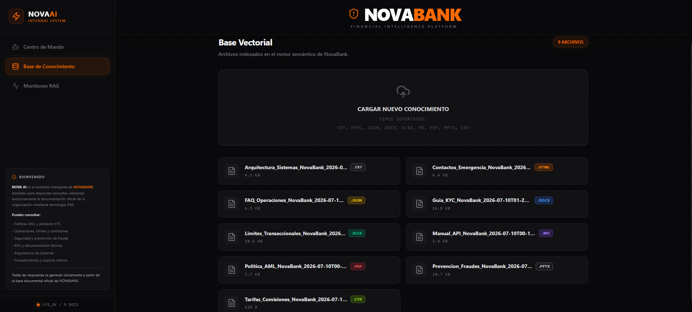
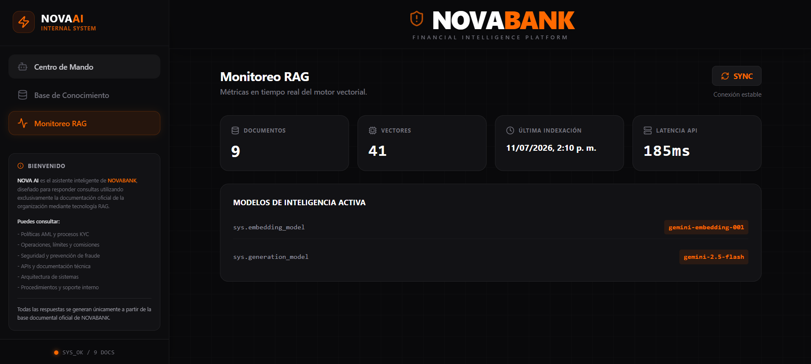
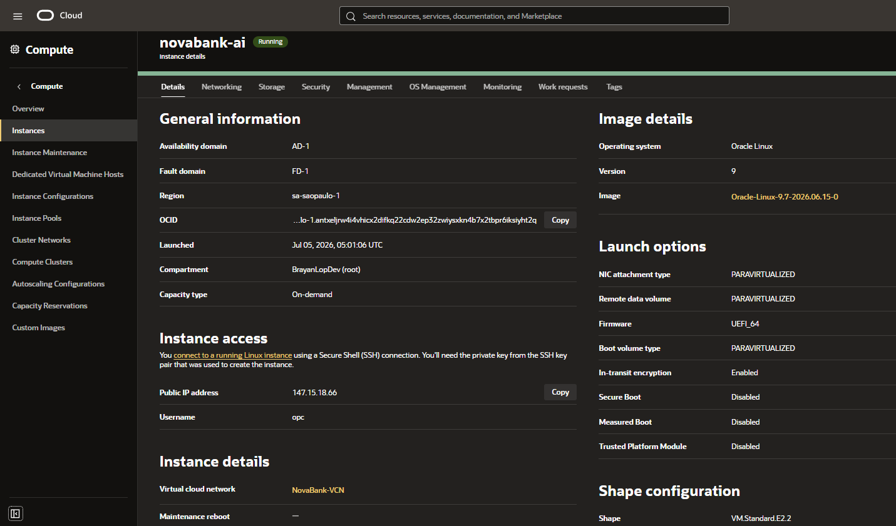
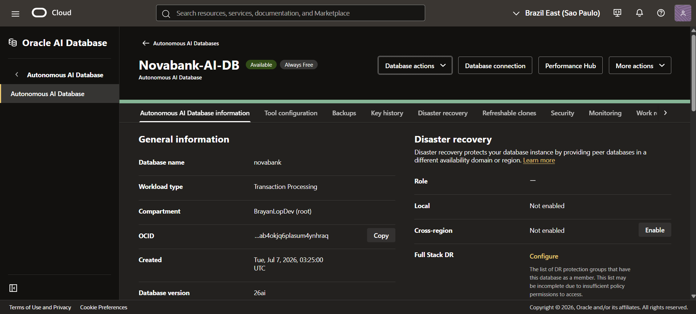
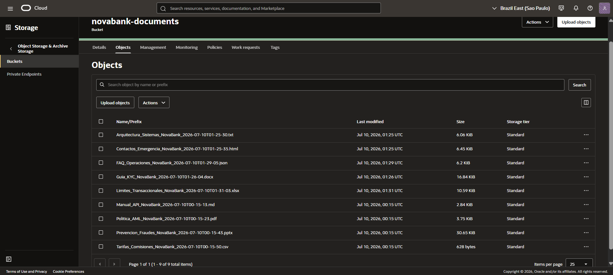
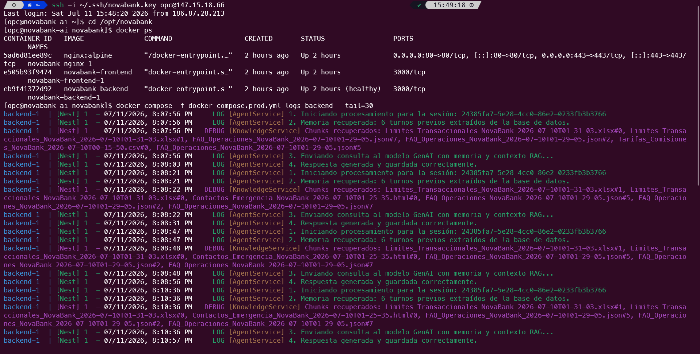

<div align="center">


# NovaBank AI — Asistente Corporativo de Conocimiento

**Un agente RAG con memoria conversacional, construido sobre Oracle Autonomous Database 26ai (AI Vector Search) y Google Gemini, desplegado 100% en Oracle Cloud Infrastructure.**

[🔗 Demo en vivo](https://novabankaiassistant.duckdns.org) · [📂 Repositorio](https://github.com/BrayanCLR/novabank-ai-assistant)

     

</div>

---

## Qué es esto

NovaBank es una fintech ficticia. NovaBank AI es su asistente de inteligencia corporativa: un agente conversacional que responde preguntas de los colaboradores basándose **exclusivamente** en la documentación interna real de la empresa — políticas de AML, guías de KYC, límites transaccionales, prevención de fraude — nunca en conocimiento externo ni inventado.

No es un wrapper de un LLM con un prompt largo. Es un pipeline de **RAG (Retrieval-Augmented Generation)** real: los documentos se fragmentan, se convierten en vectores semánticos, se almacenan en una base de datos vectorial en la nube, y cada pregunta se responde recuperando solo los fragmentos genuinamente relevantes — con la fuente exacta citada en cada respuesta.

## Características principales

- 🔍 **Búsqueda semántica real** — embeddings de Gemini (`gemini-embedding-001`) + Oracle AI Vector Search, no coincidencia de palabras clave.
- 📄 **9 formatos de documento** — PDF, DOCX, XLSX, PPTX, CSV, JSON, TXT, HTML, Markdown, todos a través de un único parser unificado.
- 💬 **Memoria conversacional** — las preguntas de seguimiento heredan el contexto de la conversación, persistida en base de datos.
- 📌 **Respuestas siempre citadas** — cada respuesta indica el documento exacto de origen; si la información no existe en la base de conocimiento, lo dice explícitamente en vez de inventar.
- 🗂️ **Gestión de documentos en caliente** — subir, listar, descargar y eliminar documentos sin reiniciar el servidor, con reindexación automática.
- 🌐 **Landing page multi-idioma** — español, inglés y portugués, con tema claro/oscuro.
- 📱 **Diseño 100% responsivo** — interfaz adaptada para dispositivos móviles, tablets y escritorio, con una experiencia consistente en todos los tamaños de pantalla.
- ☁️ **Infraestructura 100% en OCI** — Compute Instance, Autonomous Database con AI Vector Search, y Object Storage, sin depender de ningún otro proveedor de nube.

## Arquitectura



### Flujo de una consulta (RAG)



## Stack tecnológico

| Capa | Tecnología |
|---|---|
| Frontend | Next.js 16 (React 19), Tailwind CSS v4, lucide-react |
| Backend | NestJS 11, TypeScript |
| IA generativa | Google Gemini 2.5 Flash (`@google/genai`, SDK unificado) |
| Embeddings | `gemini-embedding-001`, truncado a 768 dimensiones, task types asimétricos (`RETRIEVAL_DOCUMENT` / `RETRIEVAL_QUERY`) |
| Base de datos vectorial | Oracle Autonomous Database 26ai — AI Vector Search (`VECTOR(768, FLOAT32)`, `VECTOR_DISTANCE`) |
| Almacenamiento de archivos | OCI Object Storage, autenticación por Instance Principal |
| Procesamiento de documentos | `officeparser` (parser unificado para 9 formatos) |
| Infraestructura | OCI Compute Instance (Oracle Linux 9), Docker Compose, Nginx, Let's Encrypt |
| DNS | DuckDNS |

## Estructura del proyecto

```
novabank-ai-assistant/
├── backend-agent/               # API NestJS
│   └── src/agent/
│       ├── domain/              # Interfaces y tipos, sin dependencias externas
│       ├── application/         # Casos de uso (AgentService, DTOs)
│       ├── infrastructure/      # Gemini, Oracle, Object Storage, parsers, chat
│       └── controller/          # Endpoints HTTP
├── frontend-chat/               # Next.js
│   └── app/
│       ├── page.tsx              # Landing page (ES/EN/PT, tema claro/oscuro)
│       ├── chat/page.tsx         # Dashboard: chat, documentos, estado del sistema
│       ├── components/           # Componentes UI: Chat, Knowledge y Status
│       └── lib/
├── knowledge_base/                 # Documentos de muestra para desarrollo local
├── docker-compose.yml              # Entorno local (Oracle 23ai Free en contenedor)
├── docker-compose.prod.yml         # Producción (Autonomous DB administrado, sin contenedor de BD)
├── init.sql / init-production.sql  # Esquema: knowledge_vectors, chat_sessions
├── nginx/conf.d/                   # Reverse proxy + SSL
└── scripts/                        # Migración de esquema, renovación de certificado
```

## Decisiones de arquitectura (y por qué)

- **Oracle Autonomous Database sobre PostgreSQL+pgvector**: el Always Free tier de OCI incluye Autonomous Database con AI Vector Search sin costo permanente; la alternativa de Postgres administrado en OCI es de pago desde el primer día. Además, usar la base de datos nativa de OCI demuestra mejor el uso de servicios propios de la nube que un motor genérico disponible en cualquier proveedor.
- **Sin índice vectorial**: a la escala actual (decenas de fragmentos), `VECTOR_DISTANCE` sin índice ya es instantáneo. Crear un índice HNSW/IVF en la capa Free puede consumir mucho más disco del esperado — un riesgo real evitado deliberadamente hasta que la escala lo justifique.
- **Instance Principal en vez de API keys**: el Compute Instance se autentica ante Object Storage usando su propia identidad de IAM (Dynamic Group + Policy). Ninguna credencial de larga duración vive en el código ni en variables de entorno.
- **`officeparser` como parser unificado**: en vez de una librería distinta por formato (que fue el plan inicial), un único parser cubre PDF, DOCX, XLSX, PPTX, CSV, HTML y Markdown; TXT y JSON se leen directamente. Menos superficie de dependencias, menos riesgo de romperse por cambios de API entre versiones.
- **Contexto RAG fresco, historial "limpio"**: en cada turno, solo la pregunta actual se envuelve con el contexto documental recuperado; el historial de turnos anteriores se pasa sin ese contexto repetido, evitando que el prompt crezca sin control turno tras turno.
- **`docker-compose.yml` vs `docker-compose.prod.yml`**: el primero levanta Oracle 23ai Free en un contenedor para desarrollo local sin tocar datos reales; el segundo se conecta al Autonomous Database administrado — Docker en producción solo orquesta Next.js, NestJS y Nginx, nunca la base de datos.

## Desafíos técnicos resueltos

Una muestra de problemas reales encontrados durante el desarrollo — documentados porque el proceso de depuración es tan parte del proyecto como el resultado final:

- **`oracledb` devolvía filas como arrays posicionales, no objetos** — sin `oracledb.outFormat = oracledb.OUT_FORMAT_OBJECT`, cada `row.NOMBRE_COLUMNA` devolvía `undefined` silenciosamente, sin ningún error.
- **Columnas CLOB llegaban como objetos `Lob` sin convertir** — el contexto recuperado se interpolaba como literalmente `"[object Object]"` en el prompt hasta agregar `oracledb.fetchAsString = [oracledb.CLOB]`.
- **`NEXT_PUBLIC_API_URL` de Next.js se "hornea" en tiempo de build, no de runtime** — cambiar la variable de entorno y reiniciar el contenedor no bastaba; había que pasarla como build `ARG` de Docker y reconstruir la imagen.
- **Nginx no relee su configuración al montar un volumen actualizado** — `docker compose up -d` no reinicia un contenedor cuyo *contenido* de archivo montado cambió si su definición de servicio no cambió; requiere `restart` explícito.

## Puesta en marcha local

```bash
git clone https://github.com/BrayanCLR/novabank-ai-assistant.git
cd novabank-ai-assistant

# Backend
cd backend-agent
cp .env.production.example .env   # completa con tus credenciales
npm install

# Base de datos local (Oracle 23ai Free en Docker)
cd ..
docker compose up -d
npm run start:dev --prefix backend-agent

# Frontend
npm install --prefix frontend-chat
npm run dev --prefix frontend-chat
```

## Variables de entorno

| Variable | Descripción |
|---|---|
| `GEMINI_API_KEY` | API key de Google AI Studio |
| `GEMINI_MODEL` | Modelo de generación (`gemini-2.5-flash`) |
| `EMBEDDING_MODEL` | Modelo de embeddings (`gemini-embedding-001`) |
| `ORACLE_USER` / `ORACLE_PASSWORD` | Credenciales de Oracle Database |
| `ORACLE_CONNECT_STRING` | Alias de conexión (local: `host:puerto/servicio`; producción: alias del wallet, ej. `novabank_medium`) |
| `ORACLE_WALLET_LOCATION` / `ORACLE_WALLET_PASSWORD` | Solo en producción, para la conexión mTLS al Autonomous Database |
| `OCI_BUCKET_NAME` | Bucket de Object Storage (solo producción) |
| `NEXT_PUBLIC_API_URL` | URL pública del backend, consumida por el frontend |

## Referencia de la API

| Método | Ruta | Descripción |
|---|---|---|
| `POST` | `/agent/ask` | Envía una pregunta al agente (`{ mensaje, sessionId }`) |
| `GET` | `/agent/status` | Estado del sistema: documentos indexados, chunks, modelos activos |
| `GET` | `/knowledge/documents` | Lista los documentos de la base de conocimiento |
| `POST` | `/knowledge/upload` | Sube un documento nuevo (multipart/form-data) |
| `GET` | `/knowledge/download/:fileName` | Descarga un documento |
| `DELETE` | `/knowledge/:fileName` | Elimina un documento y reindexa |

## Capturas de pantalla

| | |
|---|---|
|  |  |
| Landing page (tema oscuro) | Dashboard — conversación con citación de fuente |
|  |  |
| Gestión de documentos | Panel de estado del sistema |
|  |  |
| Consola OCI — Compute Instance | Consola OCI — Autonomous Database |
|  |  |
| Consola OCI — Object Storage | `docker compose ps` en producción |

## Roadmap

Evoluciones planeadas, fuera del alcance de esta entrega:

- Re-ranking de resultados recuperados antes de generar la respuesta
- Ingesta automática de documentos (watch de carpetas / eventos de Object Storage)
- Control de acceso por roles
- Dashboard administrativo con métricas históricas
- Índice vectorial (HNSW) cuando el volumen de documentos lo justifique

## Seguridad

- Autenticación a Object Storage vía Instance Principal — sin API keys en código ni en variables de entorno
- Conexión a Oracle Autonomous Database vía wallet con mTLS
- Validación de entrada con `class-validator` en todos los endpoints
- HTTPS obligatorio (Let's Encrypt, renovación automática)
- Headers de seguridad en Nginx (`X-Content-Type-Options`, `X-Frame-Options`, `Strict-Transport-Security`)

## Autor

**Brayan López** — Proyecto desarrollado como parte del challenge de ONE AI TECH BUILDER, aplicando NestJS, Next.js, Oracle Database 26ai y Google Gemini en un despliegue real de producción.